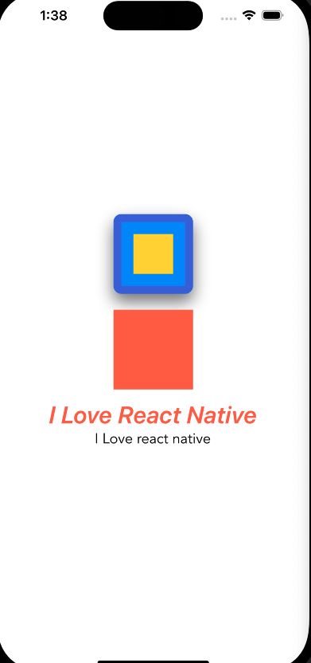

# react-native-app

## Install Expo for building the react native apps

```node
npm i -g expo-cli
```

Install React Native Tools extension - https://marketplace.visualstudio.com/items?itemName=msjsdiag.vscode-react-native

Install React Native/ React/ Redux snippets - https://marketplace.visualstudio.com/items?itemName=EQuimper.react-native-react-redux

Install Prettier - https://marketplace.visualstudio.com/items?itemName=esbenp.prettier-vscode

Install Material icon theme - https://marketplace.visualstudio.com/items?itemName=PKief.material-icon-theme

## Setting up the project

```expo
expo init DoneWithIt
```

## Running the App

```node
npm start
```

## Building the App

### Layouts

1. Dimensions
   `Dimensions.get("screen")`
2. Device Orientation
   `npm i @react-native-community/hooks`
3. Flexbox

   - `flex`
   - `flexDirection: row` - defaults the alignment of the comntainer in the horizontal axis
   - `justifyContent` - justifies the contents with respect to the primary axis
   - `alignItems` - secondary alignment of the views.
   - `flexWrap`
   - `alignContent`

4. Absolute & Relative Positioning

   - `position: relative` - default is always relative

   ```js
   import {
     Dimensions,
     StyleSheet,
     SafeAreaView,
     StatusBar,
     Text,
     View,
   } from "react-native";

   import {
     useDimensions,
     useDeviceOrientation,
   } from "@react-native-community/hooks";

   export default function App() {
     console.log(Dimensions.get("screen"));
     console.log(useDimensions);
     console.log(useDeviceOrientation());

     const { landscape } = useDeviceOrientation();

     return (
       <View
         style={{
           backgroundColor: "white",
           flex: 1,
           flexDirection: "row", // horizontal
           justifyContent: "center", // main
           alignItems: "center", // secondary
           // alignContent: "center",
           // flexWrap: "wrap",
         }}
       >
         <View
           style={{
             backgroundColor: "dodgerblue",
             width: 100,
             height: 100,
             //alignSelf: "flex-start",
           }}
         />
         <View
           style={{
             backgroundColor: "gold",
             width: 100,
             height: 100,
           }}
         />
         <View
           style={{
             backgroundColor: "tomato",
             width: 100,
             height: 100,
           }}
         />
         <View
           style={{
             backgroundColor: "gray",
             width: 100,
             height: 100,
           }}
         />
       </View>
     );
   }

   const styles = StyleSheet.create({
     container: {
       flex: 1,
       backgroundColor: "#fff",
       alignItems: "center",
       justifyContent: "center",
     },
   });
   ```

### Styles

1. Style Properties
2. Organizing Styles
3. Platform-specific Styles
   - border
   - shadow
   - padding
   - margin
   - font styling

```js
import { View, Text, StyleSheet, Platform } from "react-native";
import React from "react";

export default function AppText({ children }) {
  return <Text style={styles.text}>{children}</Text>;
}

const styles = StyleSheet.create({
  text: {
    fontSize: 18,
    fontFamily: Platform.OS === "android" ? "Roboto" : "Avenir",
  },
});
```

```js
import { View, Text } from "react-native";
import React from "react";
import WelcomeScreen from "./app/screens/WelcomeScreen";
import ViewImageScreen from "./app/screens/ViewImageScreen";

import AppText from "./app/components/AppText";

export default function App() {
  return (
    <View
      style={{
        flex: 1,
        justifyContent: "center",
        alignItems: "center",
      }}
    >
      <View
        style={{
          backgroundColor: "dodgerblue",
          width: 100,
          height: 100,
          borderWidth: 10,
          borderColor: "royalblue",
          borderRadius: 10,
          shadowColor: "grey",
          shadowOffset: {
            width: 0,
            height: 10,
          },
          shadowOpacity: 1,
          shadowRadius: 10,
          elevation: 10,
          padding: 15,
        }}
      >
        <View
          style={{
            backgroundColor: "gold",
            width: 50,
            height: 50,
          }}
        ></View>
      </View>
      <View
        style={{
          backgroundColor: "tomato",
          width: 100,
          height: 100,
          margin: 20,
        }}
      ></View>

      <Text
        style={{
          fontStyle: "italic",
          fontWeight: "600",
          fontSize: 30,
          color: "tomato",
          textTransform: "capitalize",
          textAlign: "center",
          lineHeight: 30,
        }}
        // Custom Text
      >
        I Love react native
      </Text>
      <AppText>I Love react native</AppText>
    </View>
  );
}
```



4. Icons

```js
import { View, Text } from "react-native";
import React from "react";
import WelcomeScreen from "./app/screens/WelcomeScreen";
import ViewImageScreen from "./app/screens/ViewImageScreen";

import AppText from "./app/components/AppText";

import { MaterialCommunityIcons } from "@expo/vector-icons";

export default function App() {
  return (
    <View
      style={{
        flex: 1,
        justifyContent: "center",
        alignItems: "center",
      }}
    >
      <MaterialCommunityIcons name="email" size={60} color="red" />
    </View>
  );
}
```

5. Platform specific styling

```js
const styles = StyleSheet.create({
  text: {
    ...Platform.select({
      ios: {
        fontSize: 20,
        fontFamily: "Avenir",
      },
      android: {
        fontSize: 30,
        fontFamily: "Roboto",
      },
    }),
  },
});
```
